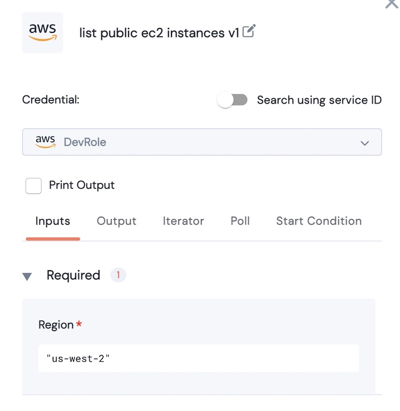
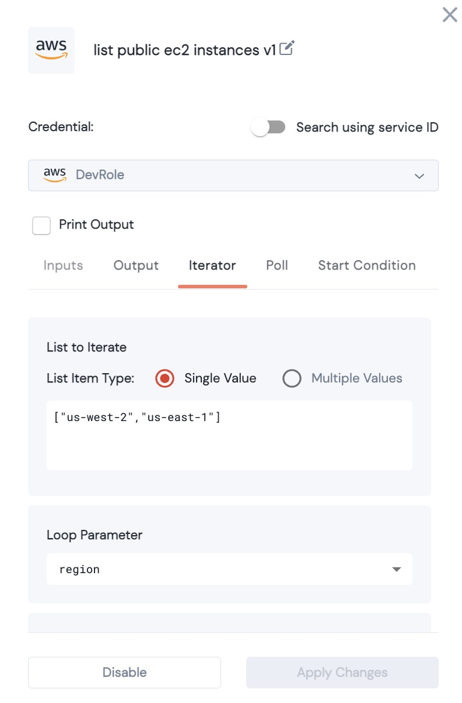

# Action Iterator

### Reuse the same Action multiple times



Action inputs are generally designed for a single value.&#x20;

> For example, a string input named _**AWS Region**_ will accept "us-west-2". &#x20;

<figure><figcaption><p>Action using a single reagion as input</p></figcaption></figure>

But what if you need to test the same action across \*many regions\*? Rather than hardcoding multiple instances of the same action, you can use the Iterator to execute the same action multiple times.


> Example: Using the iterator. The **List to iterate** entry has 2 values: 'us-west-2' and 'us-east-1'.  The iterator will iterate over the parameter 'region'. This action will be run twice (serially) with each value for region.

<figure><figcaption></figcaption></figure>

<figure><figcaption></figcaption></figure>

The values of the iteration are stored in a Dict:


```json
{'us-west-2': 
		{<us-west-2 values>}, 
'us-east-1': 
		{<us-east-1 values>}
}
```

### Iteration with a variable

The List Item can also be a variable. Below, \*\*regionList\*\* is used. The Action will run once for each value in the list.

<figure><figcaption></figcaption></figure>

### Iteration with multiple values.

Imagine that you have an Action that takes in two parameters, and you want to iterate through several permutations.  This can be done with a list of Dictionaries:

Example:  We would like to update the tags of various resources at AWS.  If we build a list of dictionaries as follows:

```
[ {'arn': ['arn:aws:ec2:us-west-2::image/instance'], 
    'value': 'unskript'
   }, 
  {'arn': ['arn:aws:ec2:us-west-2::image/instance2'],
   'value': 'unskript'
   }
]
```

Here we have 2 AWS arn values, and two tag values.&#x20;

In the **Add Tag to AWS Resources,** we can iterate over this list as follows:

<figure><figcaption></figcaption></figure>

This reads the output\_list, and places the value for 'arn' in the 'resource\_arn' parameter, and 'value' in the 'tag\_value' parameter.\
\
