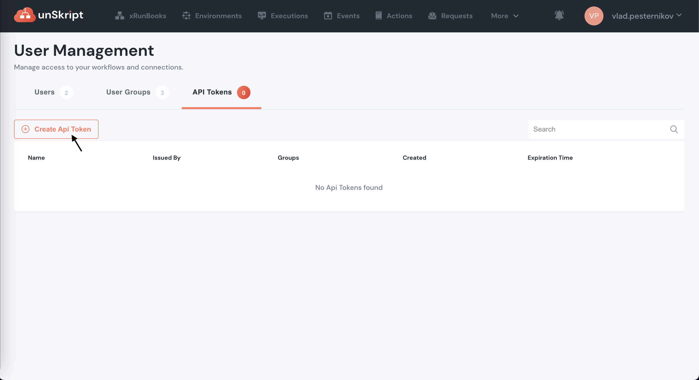
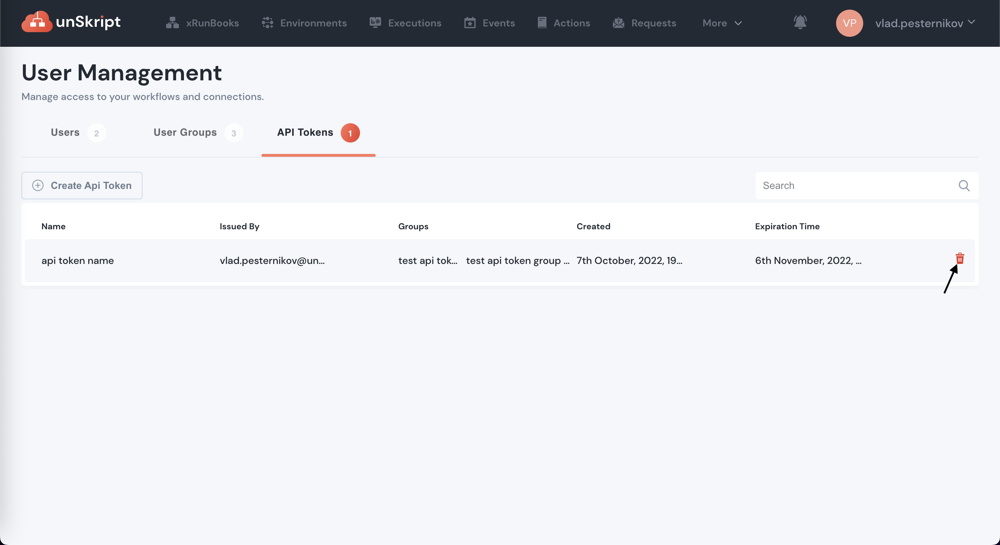

# Authentication

Unskript API uses API tokens to authenticate your requests. &#x20;

### **Create a API Token:**&#x20;

Note: API keys can be created and revoked by users with admin access rights.&#x20;

* Log in to your unSkript dashboard.&#x20;
* In the top navigation, under "_More_", click "_User Management._" &#x20;
* There is a tab here that lists all of your API tokens.  Click "_+Create API Token._"

<figure><figcaption></figcaption></figure>

There are three fields for each API token

* Name your API token
* Days that it remains valid
* Groups that have access to the token (Read about [Role based Access Control](../fundamentals/platform/role-based-access-control.md))

When you click "_**Create API Token**_" you will be able to copy the API Token. &#x20;


### Use of API Token

Authentication to the API is performed by supplying the `X-unSkript-API-Key` header with API token as it's value.&#x20;

Example of request to API:


```bash
curl --location --request GET 'https://dev.unskript.io/v1alpha1/workflows' --header 'X-unSkript-API-Key: <your-api-token>'
```


### &#x20;Revoke Token

Click the trash can next to the token to remove it from the unSkript system. Once removed, it cannot be recovered.

<figure><figcaption></figcaption></figure>


Your API keys carry the privileges to execute workflows (runbooks) your team owns and view results of executions so be sure to keep them secure! Do not share your API tokens in publicly accessible areas such as GitHub, client-side code, etc. All API requests must be made over HTTPS. Any requests made over plain HTTP will fail. Requests without a valid API token will fail and return a `401` error.
