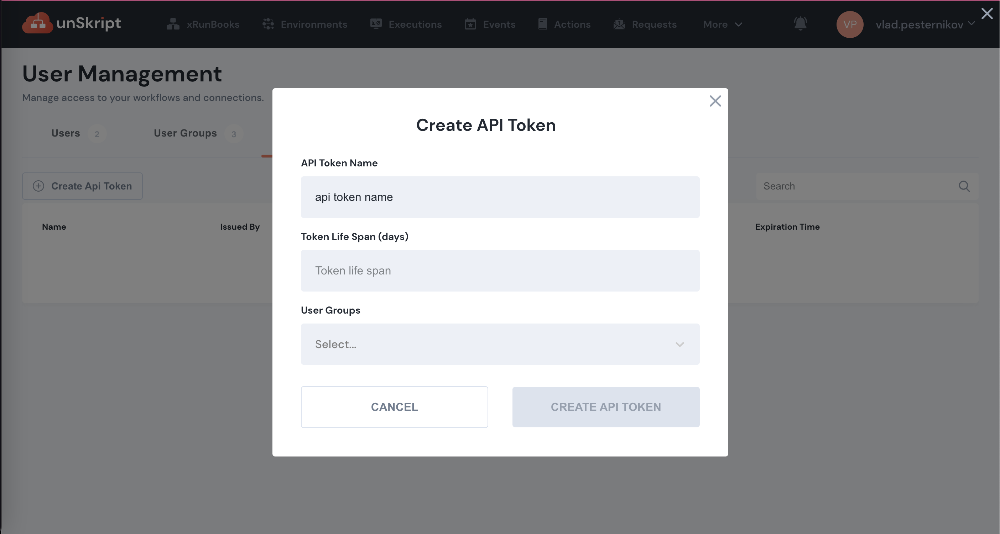
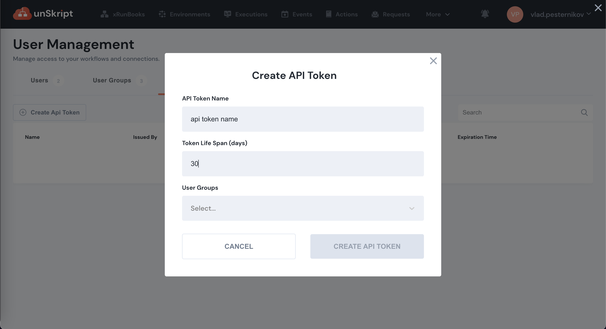
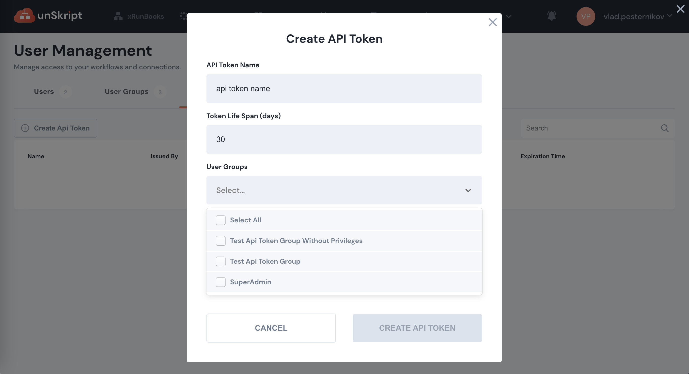
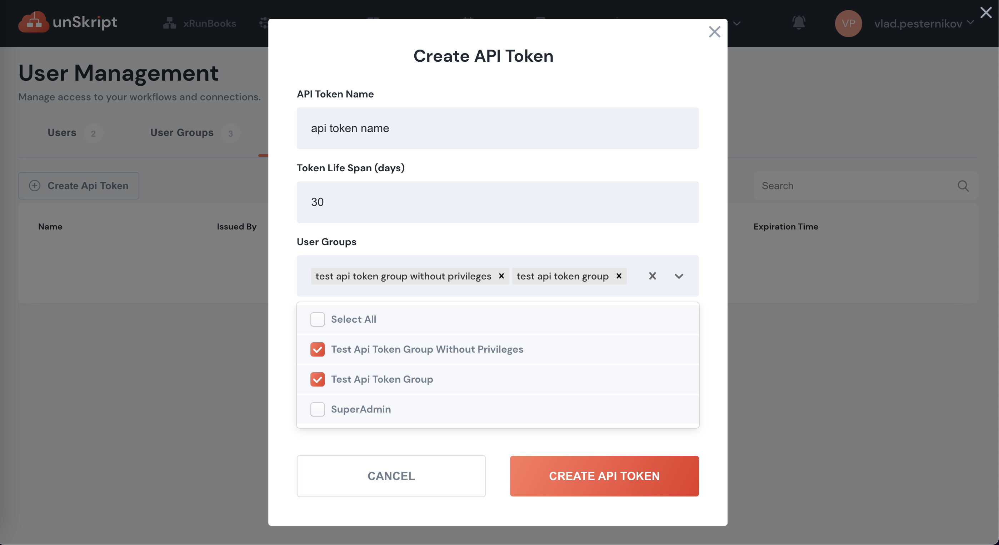
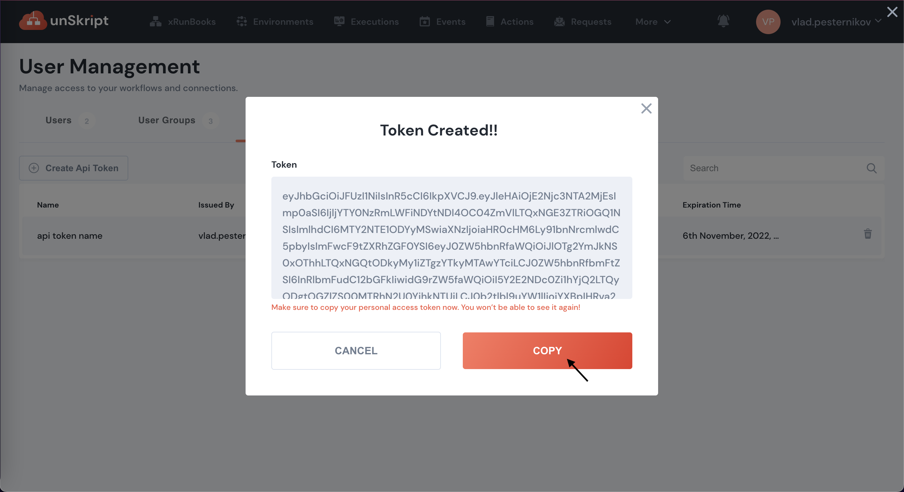

# Authentication

&#x20;Unskript API uses API tokens to authenticate your requests. Unskript authorization system is based on RBAC model with domains. Roles and domains which token will have access to same as groups, to which token is assigned during creation. Each user or token should have granted privileges in order to access resources. API tokens are basically JWT tokens. Authentication to the API is performed by supplying the `X-unSkript-API-Key` header with API token as it's value. API keys can can be viewed and managed your API keys within the SaaS. Example of request to API:

```bash
curl --location --request GET 'https://dev.unskript.io/v1alpha1/workflows' \
--header 'X-unSkript-API-Key: <your-api-token>'
```

&#x20;API keys can be created and revoked by users with admin access rights. Revoked tokens do not have access to API.

How to create API token:










\


&#x20;How to revoke API token:


&#x20;Your API keys carry the privileges to execute workflows (runbooks) your team owns and view results of executions so be sure to keep them secure! Do not share your API tokens in publicly accessible areas such as GitHub, client-side code, etc. All API requests must be made over HTTPS. Any requests made over plain HTTP will fail. Requests without a valid API token will fail and return a `401` error.
