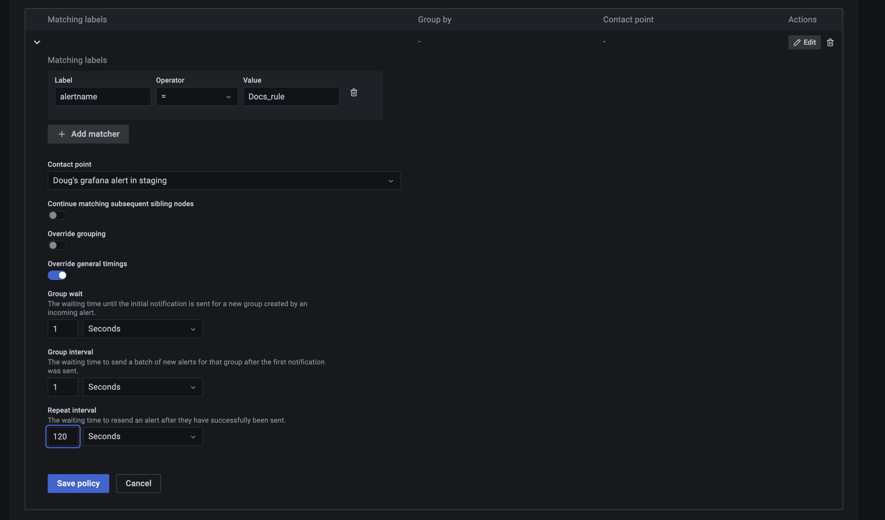

# Grafana

### [List of Grafana Actions](action\_grafana.md)

## Authentication

| Name      | Description                                                                                                   |
| --------- | ------------------------------------------------------------------------------------------------------------- |
| Name      | This credential will be listed using the name you provide                                                     |
| API Token | API token to connect to Grafana. This can be generated in the grafana dashboard under Configuration->API Keys |
| Hostname  | The hostname along with port number. Eg: http://localhost:3000                                                |

## Creating a Grafana API Token

#### Self managed Grafana

1. In your Grafana instance, click the configuration icon in the left navigation (it is the settings cog icon).
2. In the list of tabs - click API key.
3. Add an API key with the role and time you live you wish for your unSkript connection.
4. Generate the key, and copy the value.  Add this to the Credential window in unSkript.

#### Grafana cloud

Follow the steps explained [https://grafana.com/docs/grafana-cloud/reference/create-api-key/](https://grafana.com/docs/grafana-cloud/reference/create-api-key/)

## Create a Grafana Webhook

Your Grafana alerts can be used to start RunBooks or Workflows.  This requires a webhook listener in your unSkript installation. These instructions assume you have already created a credential into your Grafana instance.

1. In your unSkript installation, click \*Proxies\* from the top menu. &#x20;
2. Find the Environment where your Grafana credential is stored, and open this proxy.&#x20;
3. In your list of credentials, find your Grafana credential:
4.

    <figure><figcaption></figcaption></figure>
5. In the "webhook URL" column, Click the Generate button.
6. Copy your url/Username and password.  These will be available on this page if you need them again.

