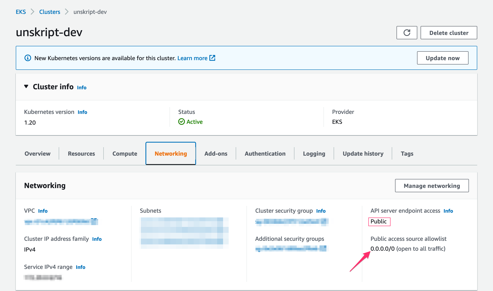

# Kubernetes

### [List of K8s xRunBooks](broken-reference)

### [List of K8s Actions](action\_kubernetes/)

### Authentication

| Name       | Description                                                                              |
| ---------- | ---------------------------------------------------------------------------------------- |
| Name       | This credential will be listed using the name you provide                                |
| Kubeconfig | Contents of the kubeconfig file, typically found in the .kube directory of your cluster. |

**Authentication in Kubeconfig**

The authentication of the command used to call an EKS cluster is done using the role assigned during SSO login of the AWS console. unSkript's proxy also has a role assigned to it which needs to have access to the client's EKS cluster.

We can specify the IAM Instance Role for an EC2 instance to enable authentication which is used by the unSkript proxy to talk to the client cluster.

To do so, edit the aws-auth ConfigMap. You can use a tool such as eksctl to update the ConfigMap or you can update it manually by editing it. You can read[ here](https://docs.aws.amazon.com/eks/latest/userguide/add-user-role.html) for detailed steps to enabling user and role access.

**Ensuring Connectivity for Amazon EKS VPC**

In order to ensure connectivity to unSkript's proxy from a private cluster, the VPC cluster security group should allow traffic from the proxy security group. Since traffic goes out with public[ NAT](https://en.wikipedia.org/wiki/Network\_address\_translation) IP as source, the source whitelist should include the public(outgoing) IP of NAT.

Refer to the security group requirements [here](https://docs.aws.amazon.com/eks/latest/userguide/sec-group-reqs.html) for updating the same.

As shown below for the unskript-dev cluster, the public access source allowlist is open to all traffic-

You can read[ here](https://docs.aws.amazon.com/eks/latest/userguide/cluster-endpoint.html) for further details on Amazon EKS cluster endpoint access control.
