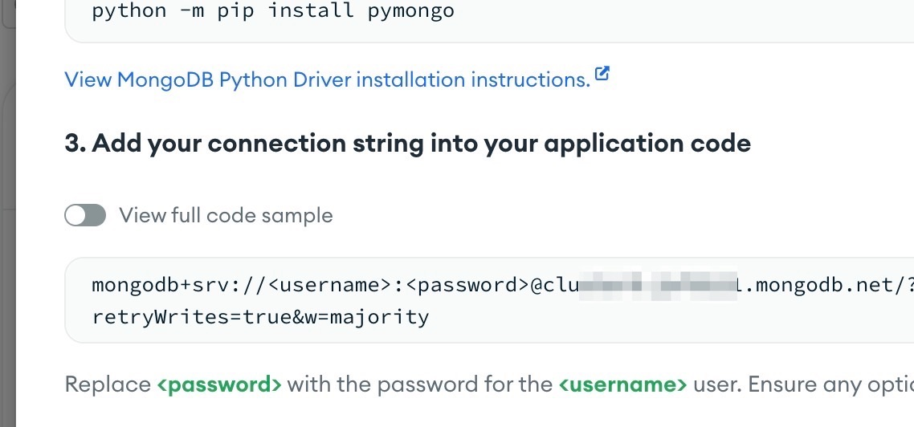

# MongoDB

### Authentication

You will need to supply either a username/password, or a public/private API keys.

[If you are using Atlas, see instructions below the table.](./#using-atlas)

| Name                  | Description                                                                              |
| --------------------- | ---------------------------------------------------------------------------------------- |
| Name                  | This credential will be listed using the name you provide                                |
| Host                  | Full MongoDB URI, in addition to simple host name. It also supports mongodb+srv:// URI's |
| Username              | Username to authenticate with MongoDB                                                    |
| Password              | Password to authenticate with MongoDB                                                    |
| Port                  | Port on which MongoDB server is listening                                                |
| Atlas API Public Key  | The public key acts as the username when making API requests                             |
| Atlas API Private Key | The private key acts as the password when making API requests                            |

### Using Atlas

#### Connect

Under DEPLOYMENT, click Database\
.png>)

On this page, click the COnnect button, and then the Drivers:\
\
.png>)

.png>)

This page will show you the URI to add:

<figure><figcaption></figcaption></figure>

Enter mongodb+srv://\<the URL after the @> into your credential

#### Create Users

In your dashboard, create a user by clicking "Database Access" under SECURITY.  Here you can add and remove users, and retrieve the password for your users.\
.png>)

#### Access

Finally, enter the NAT Gateway for your unSkript installation in the Network Access section, so that unSkript is allowed to connect to Atlas.

.png>)
