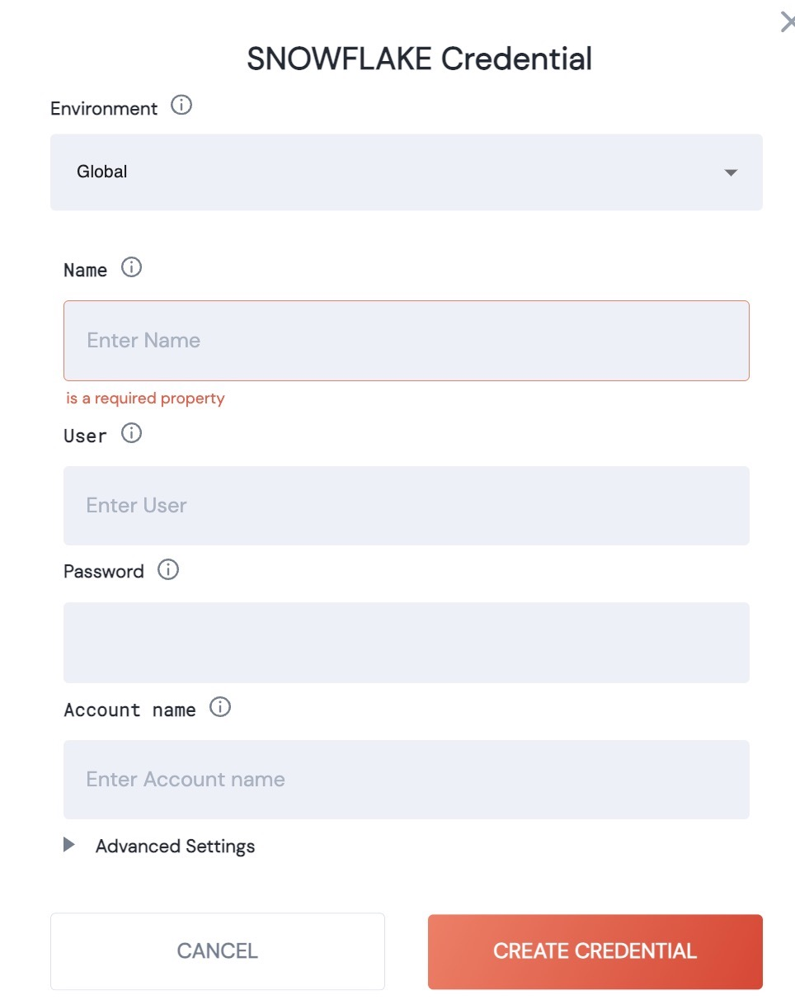

# Snowflake

### [List of Snowflake Actions](action\_snowflake.md)

### Authentication

<figure><figcaption></figcaption></figure>

| Name         | Description                                               |
| ------------ | --------------------------------------------------------- |
| Name         | This credential will be listed using the name you provide |
| User         | User name                                                 |
| Password     | Your password                                             |
| Account Name | Name of the Snowflake account                             |

