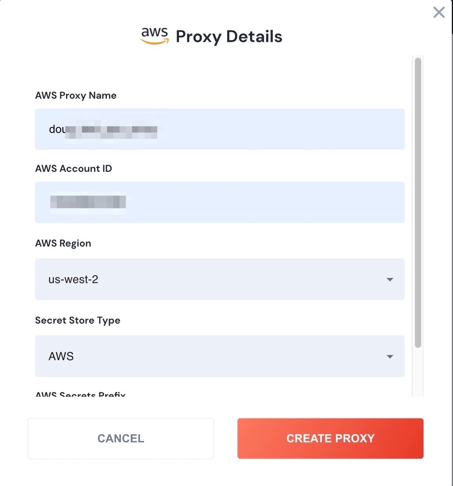

# AWS Proxy

Since much of your infrastructure may be behind an AWS firewall, and not accessible to the public internet, installing an unSkript proxy in your AWS account will allow unSkript RunBooks the ability to connect with your systems.

### Requirements

* Since the proxy doesnt get a public IP and it should be able to reach internet, it should be deployed in a VPC where there is a NAT gateway.
* It should be deployed in a private subnet, as the default route in those subnets points to NAT gateway.
* If you want a single proxy to access multiple VPCs, ensure that you install in a VPC, which has access to the other VPCs (hub and spoke topology)&#x20;

### Creating the Proxy

Ensure that you have admin rights to your AWS account.

To set up an AWS Hosted Proxy, click the Proxies link inside your unSkript dashboard.  Then click the **+ Add Proxy** button and select **AWS Hosted**.

Enter:

* Proxy name
* AWS account ID
* AWS Region
* Secret Store Type

<figure><figcaption></figcaption></figure>

This will Generate a Cloud Formation Template that will be used to generate the proxy.  Download this to your local machine.

Now, Login to your AWS Console to deploy the proxy.

1. Go to the Cloud Formation page.
2. Choose "Create Stack" and click "with New Resources."
3. The next page asks if you'd like to use a template. Choose "Template is Ready" and "Upload a template file" and use the file chooser to upload the template file you downloaded from unSkript. Click Next.
4. Now it is time to name your proxy and set configurations for the proxy.  The instance size and Volume size will be set by the template file, but all of the other settings must be set by your team. Click next.
5. Under permissions, leave blank, so that your login credentials are used to create the instance. Click Next.
6. This is the review page. If you are happy with your configuration, click Submit.
7. After a few minutes, your proxy creation will be complete.
