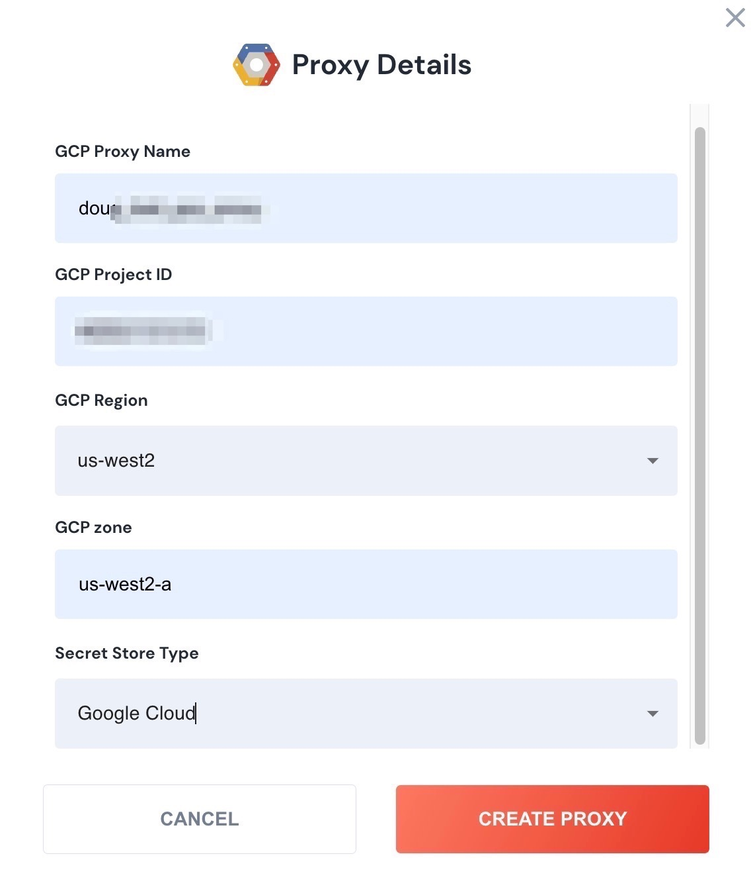

# GCP Proxy

Since much of your infrastructure may be behind a GCP firewall, and not accessible to the public internet, installing an unSkript proxy in your GCP account will allow unSkript RunBooks the ability to connect with your systems.

### Creating the Proxy

Ensure that you have admin rights to your GCP account.

To set up an GCP Hosted Proxy, click the Proxies link inside your unSkript dashboard.  Then click the **+ Add Proxy** button and select **GCP Hosted**.

<figure><figcaption></figcaption></figure>

Click Create Proxy.

Now, login to your Cloud Console.

1. Step 1: Create a Service Account.
   1. Search for IAM, and choose "IAM & Admin.
      1. Select "Service Accounts" from the left navigation.
      2. Click "Create Service Account."
      3. Give your Service account a Name and Description. Click "Create and Continue."
      4. **Grant this service account access to project.** Add "Secret Manager Admin."
      5. Add a Condition.  We will name it "Secrets Manager."
      6. The first Condition will be:
         1. Condition Type: Service
         2. Operator: Is
         3. Resource Service: Google Secrets Manager
      7. Condition 2 (with an AND):
         1. Condition Type: Name
         2. Operator: Starts With
         3. Value: "projects/{PROJECT\_NUMBER}/secrets/unskript" where Project Number is your GCP project number.
      8. Next, we'll create our virtual machine. Search for "VM Cloud Compute."
      9. Launch the VM in the same Region and Zone as selected in the unSkript menu.
      10. Ensure your VM has at least 2 CPUs, 8 GB of RAM and 64 GB of disk space.
      11. Boot Disk: Select the image. (Contact your unSkript representative to get this shared into your account).
      12. Identity and API access: Choose the Service Account created above.
      13. Create the Proxy.
