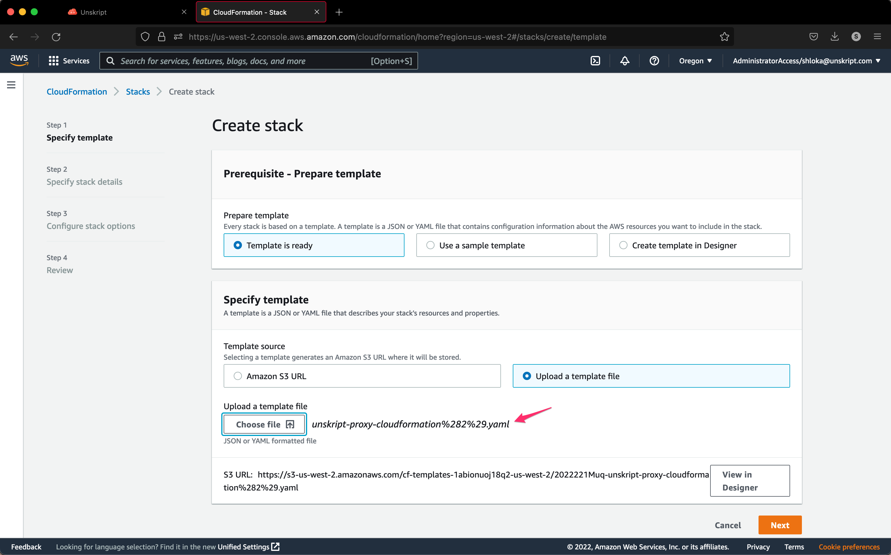
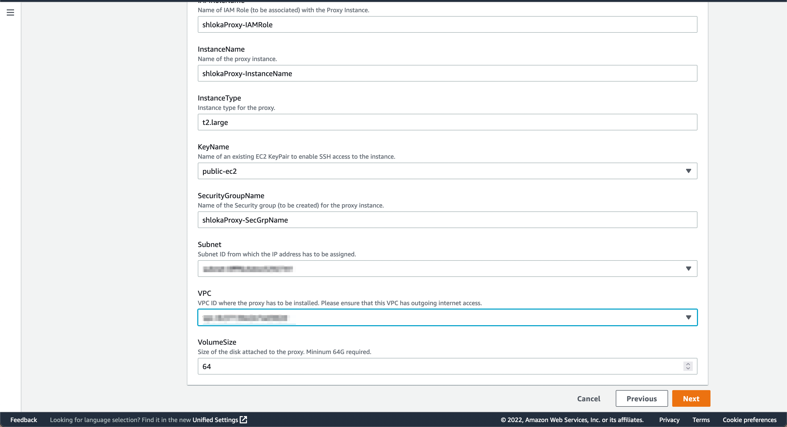

# AWS hosted Proxy

unSkript's Runtime Environment works like a proxy and can be hosted seamlessly like a virtual machine in the client's environment.

In this tutorial, we'll establish a connection to your proxy in your AWS environment, by deploying the proxy to an AWS EC2 instance using CloudFormation.

Follow the steps as given for the proxy deployment.

Step 2 of the Proxy Deployment Instructions as on the AWS CloudFormation console-

Step 3 can be filled out this way-

Please note-

1. You can choose any permissible name for `IAMPolicyName`, `IAMRoleName`, `IAMInstanceName`, and `SecurityGroupName`.
2. `InstanceType` will be <mark style="color:orange;">t2.large</mark> and `VolumeSize` will be <mark style="color:orange;">64</mark> which will be pre-filled from the template that was uploaded in Step1.
3. For `KeyName` you can create your public and private keys by following these [steps](https://docs.aws.amazon.com/AWSCloudFormation/latest/UserGuide/cfn-console-create-keypair.html) or use an existing one.
4. While choosing a `Subnet` and `VPC`, make sure to-

* Install the unSkript proxy where the resource needs to be merged
* The resource can dial out from VPC to reach to our application

There is no need to additionally configure the stack options so you can skip to reviewing the details of the stack.

.png>)

And voilà, once the proxy is successfully deployed in the client environment, you should see the status <mark style="color:green;background-color:yellow;">`READY`</mark> for your proxy.

<figure><figcaption></figcaption></figure>
