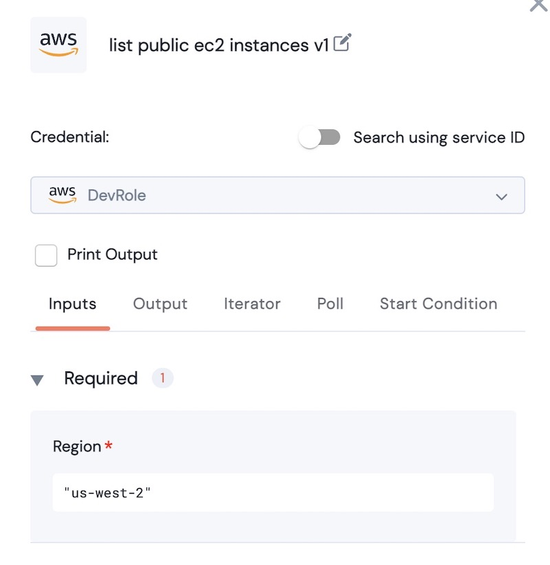
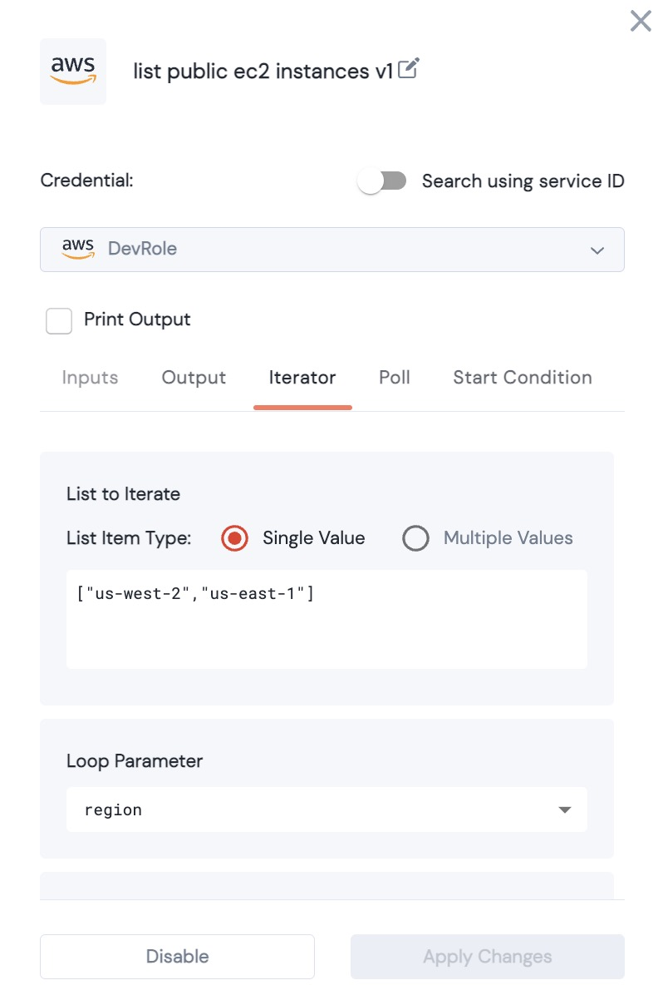

# Action Iterator

### Reuse the same Action multiple times



Action input parameters are often set for a single value: for example, an Action might require _**AWS Region**_ - as a single value.  However, it is possible to image a xRunBook where you might wish to run an Action against multiple regions (or even a varying number of regions in each invocation of the xRunBook).  Rather than hardcoding multiple instances of the same action, you can use the Iterator.


Example: This Action gives an array of Public AWS EC2 instances for a given region.  Configured as below, it will list the instances for "us-west-2":

<figure><figcaption></figcaption></figure>

However, we can run this across multiple regions by changing the Region input to an iterator:

<figure><figcaption></figcaption></figure>

We set the Loop Parameter to region &#x20;

The List item contains the values for the Loop Parameter (in the above example there are 2 regions:`["us-west-2","us-east-1"]`. &#x20;

Note, the List Item can also be a variable.

When the Action is run with the above iterator, it will run twice:

<figure><figcaption></figcaption></figure>

The values of the iteration are stored in a Dict:

```json
{'us-west-2': 
		{<us-west-2 values>}, 
'us-east-1': 
		{<us-east-1 values>}
}
```


### Dict type Iterator

<mark style="background-color:red;">To be added</mark>
