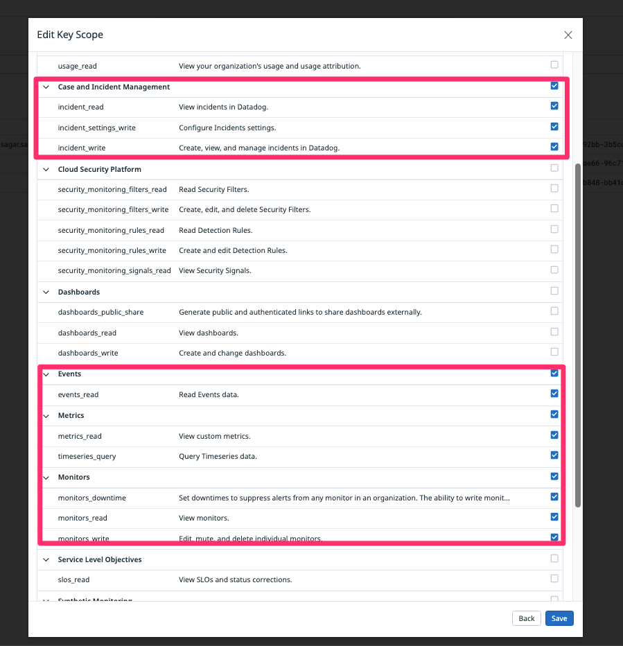

# Datadog

### [List of Datadog Actions](../../../lists/action\_DATADOG.md)

### Authentication

<figure><figcaption></figcaption></figure>

| Name                | Description                                               |
| ------------------- | --------------------------------------------------------- |
| Name                | This credential will be listed using the name you provide |
| API Key             | API key to submit metrics and events to Datadog           |
| App Key             | App key for access to Datadog's programmatic API          |
| API Host (Optional) | Datadog API endpoint. For eg: http://us3.datadoghq.com.   |

### Steps to get the API and App key from Datadog 

#### &#x20;API key or client token:

1.  Navigate to Organization settings, then click the **API keys** tab.\

    <figure><figcaption></figcaption></figure>
2. Click the **New Key** button.
3. Enter a name for your key or token.
4. Click **Create API key**.

**Notes:**

1. Your org must have at least one API key and at most 50 API keys.
2. Key names must be unique across your organization.

#### Appplication key: 

1.  To add a Datadog application key, navigate to **Organization Settings** > **Application Keys**. \

    <figure><figcaption></figcaption></figure>
2. If you have the [permission](https://docs.datadoghq.com/account\_management/rbac/permissions) to create application keys, click **New Key**.
3.  Please ensure that the key has the following scopes:\

    <figure><figcaption></figcaption></figure>

**Notes:**

1. Application key names cannot be blank.

Ref Link : [https://docs.datadoghq.com/account\_management/api-app-keys/](https://docs.datadoghq.com/account\_management/api-app-keys/)

\

\
