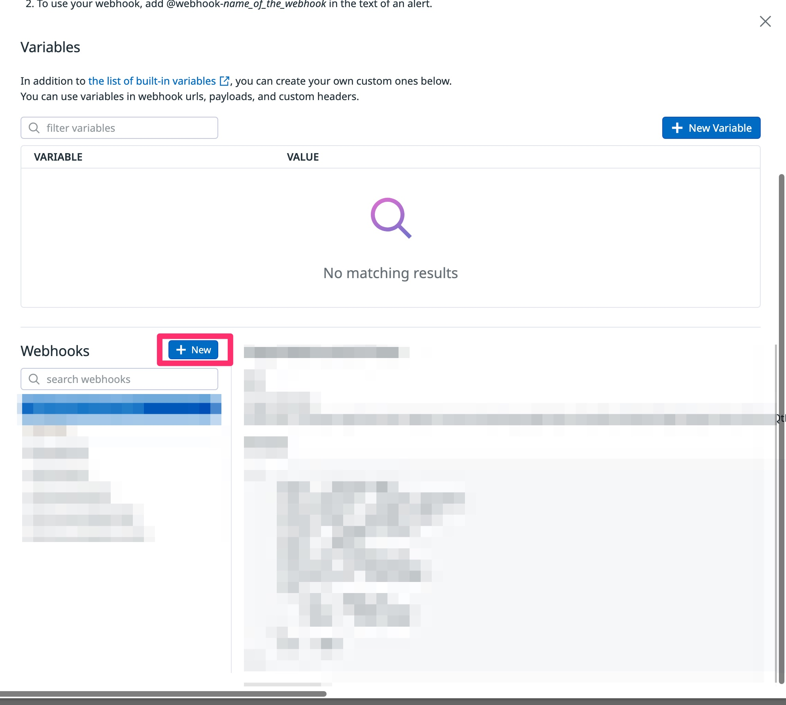
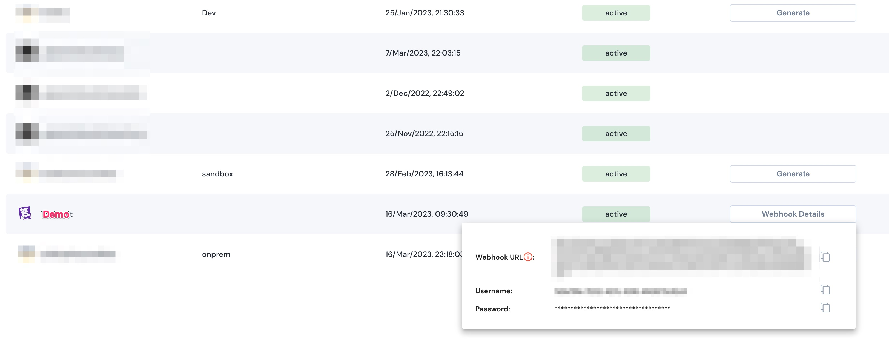
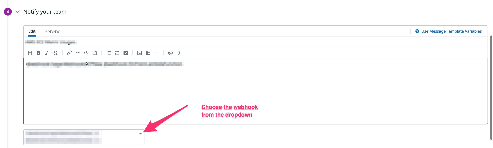

# Configuring webhook in Datadog

For unSkript to receive alerts from Datadog, you need to configure the webhook URL in Datadog.

1. On the Datadog console, click on **Integrations** and search for **Webhooks**.
2. Install **Webhooks**, if not already installed and click on **Configure**
3.  Click on **New**\
    ****

    <figure><figcaption></figcaption></figure>
4.  Fill the lambda function URL. \
    For authenticated webhook, get the username and password from the **webhook details** in the unSkript app and url should be\
    **https://\<username>:\<password>@\<lambda function url>**\
    ****

    <figure><figcaption></figcaption></figure>
5.  Configure the above webhook for monitor(s) by clicking on **Edit** monitor\

    <figure><figcaption></figcaption></figure>

