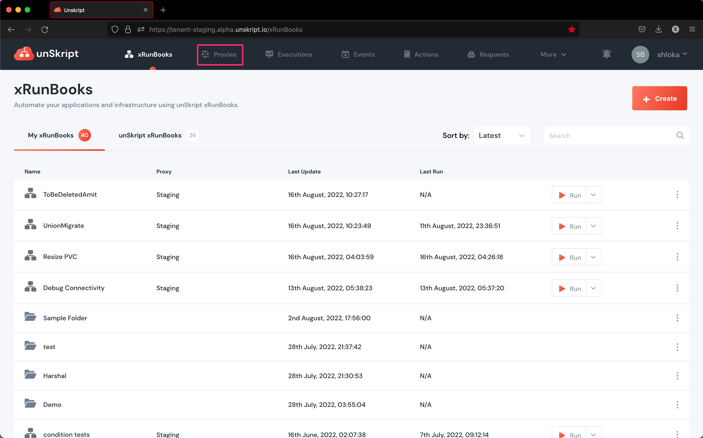

# Add Credentials to Connect your Resources

unSkript must be connected to your cloud resources. Resources can be anything - your cloud, databases, APIs, or any other other external system. Adding your Credentials to your Proxy establishes these connections.&#x20;

unSkript supports a large selection of resource types that you can connect into. To connect to an external resource, please follow these steps:



1. Click the Credentials tab at the top of the page.  It will probably say "There are no added Credentials yet."  Click the "Add Credential" button.
2. A list of predefined Services will appear. These will simplify your ability to connect to popular services securely with fewer clicks.

<figure><figcaption>
The credential services built into unSkript
</figcaption></figure>

If you do not see your service here, you can connect via REST for APIs or via SSH for servers. For.a direct connection, [open an Issue](https://github.com/unskript/Awesome-CloudOps-Automation/issues/new?assignees=\&labels=Credential%2Ctriage\&template=add\_credential.yml\&title=%5BCredential%5D%3A+), and we can add your service.

3\.  The UI will walk you through the required steps to establish your credential. If you run into issues, there are detailed instructions for each [Connector](../connectors/).




1. Go to the Proxies tab&#x20;
2. Click the Add Credential button and select the Resource type
3. Add a ServiceId and Environment name to identify this connection in different environments.
4. Follow the instructions provided to finish connecting to the Resource


**Credential Parameterization using ServiceID**

You can execute a xRunBook across different environments without having to duplicate it in each environment. Learn More about ServiceIDs


#### Actions for the Resource

Once a resource is connected, unSkript provides a set of built-in Actions that can be used to access the resource. Go to the Actions page and check out the supported Actions for your resources.




