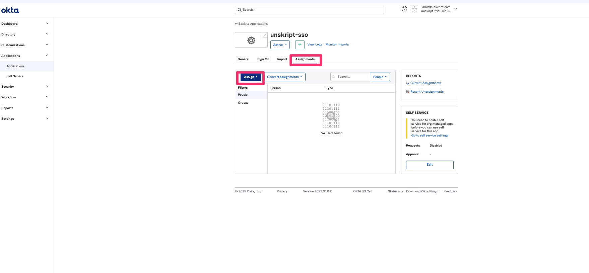

# Okta configuration


NOTE: You need to be an admin to do the following steps in Okta


*   Login into Okta and go to **Applications** section in Admin Panel\

    <figure><figcaption></figcaption></figure>
*   Create a new SAML 2.0 app\
    \

    <figure><figcaption></figcaption></figure>

    <figure><figcaption></figcaption></figure>
*   Choose an appropriate name for the app (for eg. **unSkript-sso**) and click **Next**

    <figure><figcaption></figcaption></figure>
*   On the **Configure SAML** tab, please fill in the highlighted fields\

    <figure><figcaption></figcaption></figure>


Please reach out to unSkript team at support@unskript.com for the values of the above fields.


*   In the **Attribute statements** section of the form, please fill in the following 2 attributes\

    <figure><figcaption></figcaption></figure>

    * The **name** attribute value will be  \
      `String.join(" ", user.firstName, user.lastName)`
    * The **email** attribute value will be **user.email** (Chose from the drop down)
    * Click **Next**
*   On the **Feedback** page, please check the highlighted option and click **Finish**\

    <figure><figcaption></figcaption></figure>
*   Next, we will need the Single sign-on URL and x.509 certificate to configure the SP on our side.   Click on the highlighted button to get the above values\

    <figure><figcaption></figcaption></figure>
*   Copy **Identity Provider Single Sign-On URL** and also download the certificate as highlighted below\

    <figure><figcaption></figcaption></figure>


Please send the above 2 piece of information to support@unskript.com


*   Assign users to this new application, so that sign in into unSkript application using Okta SSO. Click on **Assignments** tab to accomplish this.\

    <figure><figcaption></figcaption></figure>
