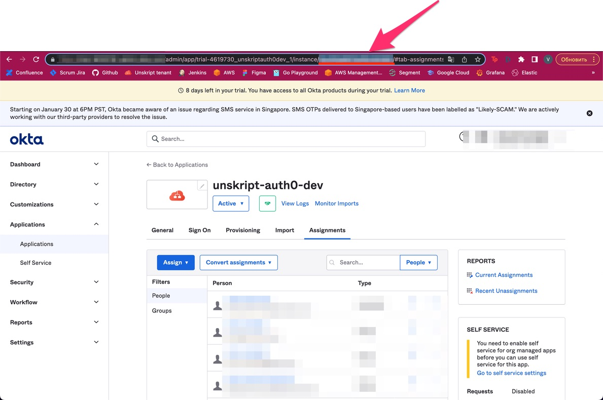
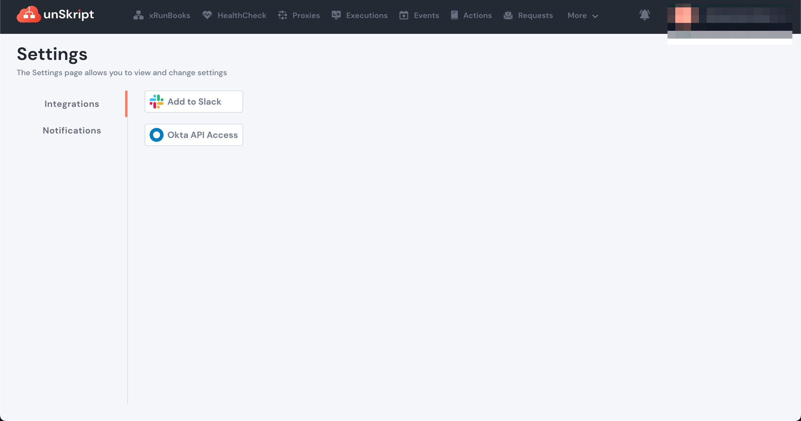
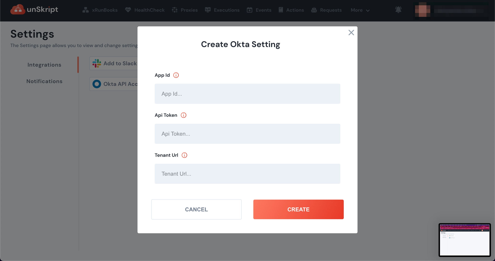

# Okta Groups Sync

We support manual Okta groups sync. The superAdmin group member can trigger the group sync by clicking on **Sync Okta Groups** on the User Groups tab.

## Credentials required for group sync

unSkript pulls the Okta groups info by using Okta API Token. We would need the following piece of information to configure API access to Okta

* **Tenant URL** - This is the url to your Okta domain, in the form `https://acme.okta.com`
* **API Token** - This should be generated by an Okta user who has **Read** access right to Applications and Groups Okta API. To generate API token, go to **Security->API->Tokens->Create token**
* **APP ID** - This is the ID of the Okta SAML application which was used during configuration of Okta as IDP for Auth0. On the Okta Admin panel,&#x20;
  * Go to **Applications->Application**
  * &#x20;Click on the Okta SAML application, configured for unSkript.
  *   The app ID is present in the url as shown below\

      <figure><figcaption></figcaption></figure>
* On unSkript, go to **More->Settings->Okta API Access** and fill in the info collected above.

<figure><figcaption></figcaption></figure>

<figure><figcaption></figcaption></figure>

* With the Okta group sync enabled, users **CANNOT** create groups inside the unSkript app.
* To trigger the Okta groups sync, go to **More->User Management->User Groups** and click on **Sync Okta Groups**. These groups can be assigned unSkript roles as explained here[role-based-access-control.md](../../../../fundamentals/platform/role-based-access-control.md "mention")
* However, users still need to be invited to the unSkript app, by the admin. Go to **More->User Management->Invite User**. Since the groups are already pulled in from Okta and unSkript has the user->group mapping, user will get the role corresponding to the Okta groups, user is part of.
