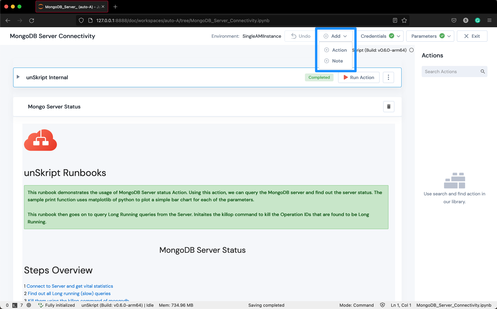
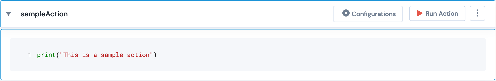
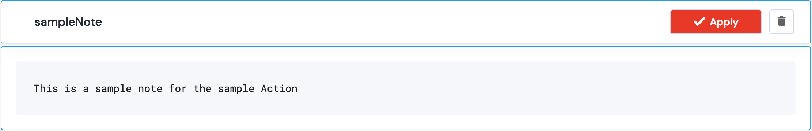
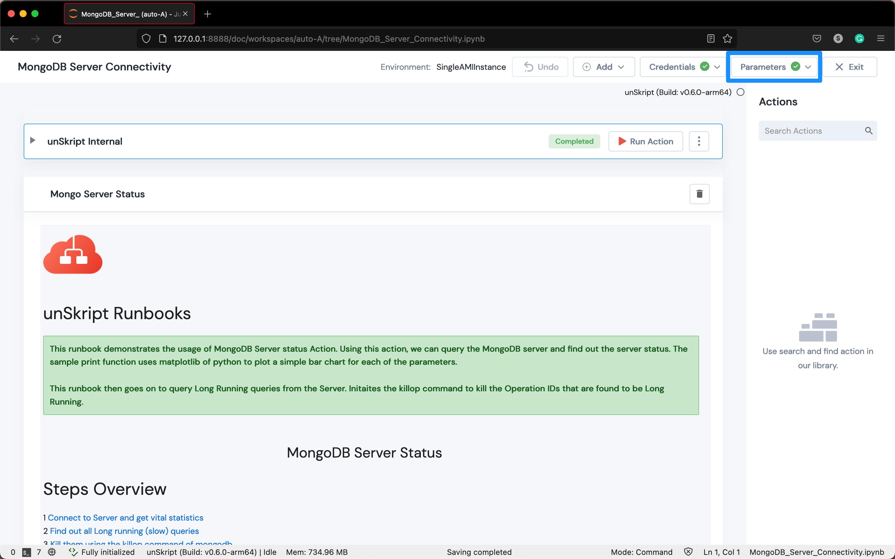
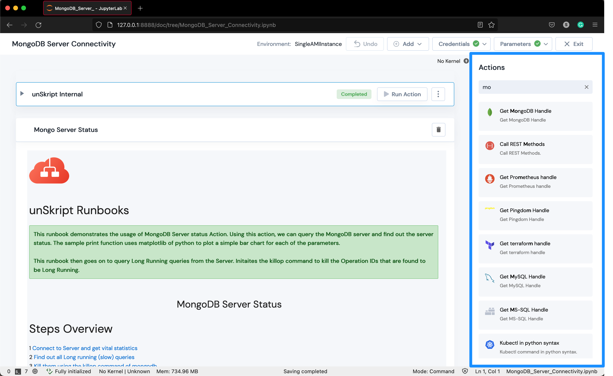
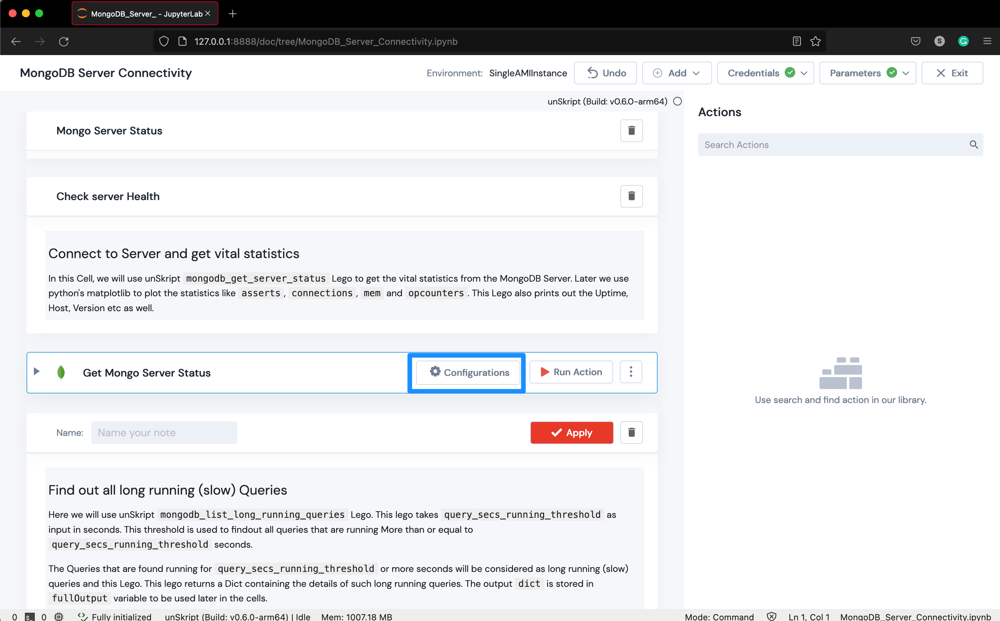
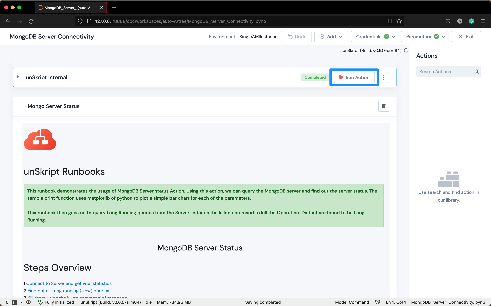

# UI and Platform Overview

unSkript offers an open source, low code, intelligent automation platform which is built on another open source platform- Jupyter Notebooks.

This section will explain the key components of our platform.

#### Add Action/ Note

<figure><figcaption></figcaption></figure>

This button enables the user to create their custom actions and custom notes.

* Custom Action

<figure><figcaption></figcaption></figure>

* Custom Note

<figure><figcaption></figcaption></figure>

#### Credentials

<figure><figcaption></figcaption></figure>

This button can be used to add resources to your xRunBook. Credentials are used to authenticate the resource that you wish to connect to while running an action.

#### Parameters

<figure><figcaption></figcaption></figure>

This button allows us to pass parameters to the xRunbook if needed.

#### Actions

<figure><figcaption></figcaption></figure>

This section allows the user to search for a built-in action. Depending on your use case you can modify the sample runbook by dragging and dropping these actions.

#### Configurations

<figure><figcaption></figcaption></figure>

This button enables us to configure the action and select credentials.

#### Run Action

<figure><figcaption></figcaption></figure>

This button is used to execute an action.

#### First Cell: unSkript Internal

<figure><figcaption></figcaption></figure>

This is the first action of every xRunbook. The unSkript Internal action initializes the kernel and prepares an environment based on which the next/ consecutive actions are run.


unSkript Internal action needs to be executed prior to any other action in the runbook.

