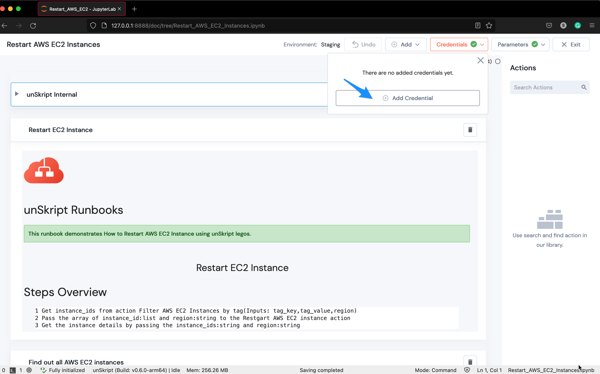
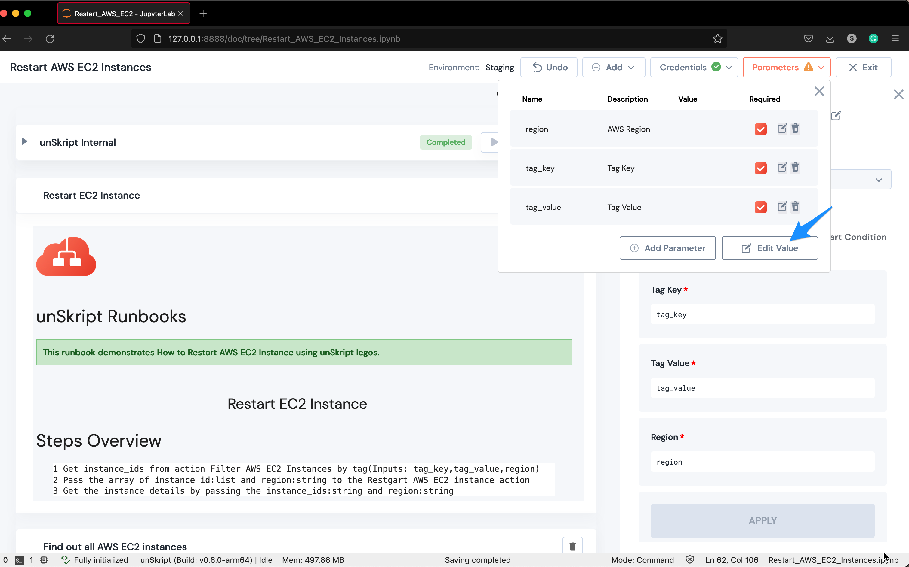
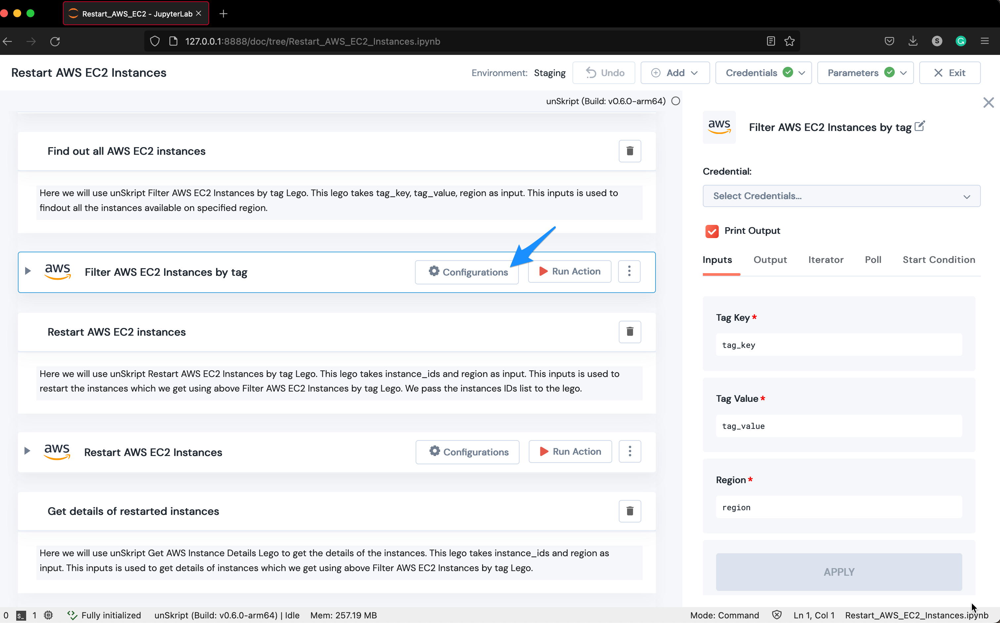
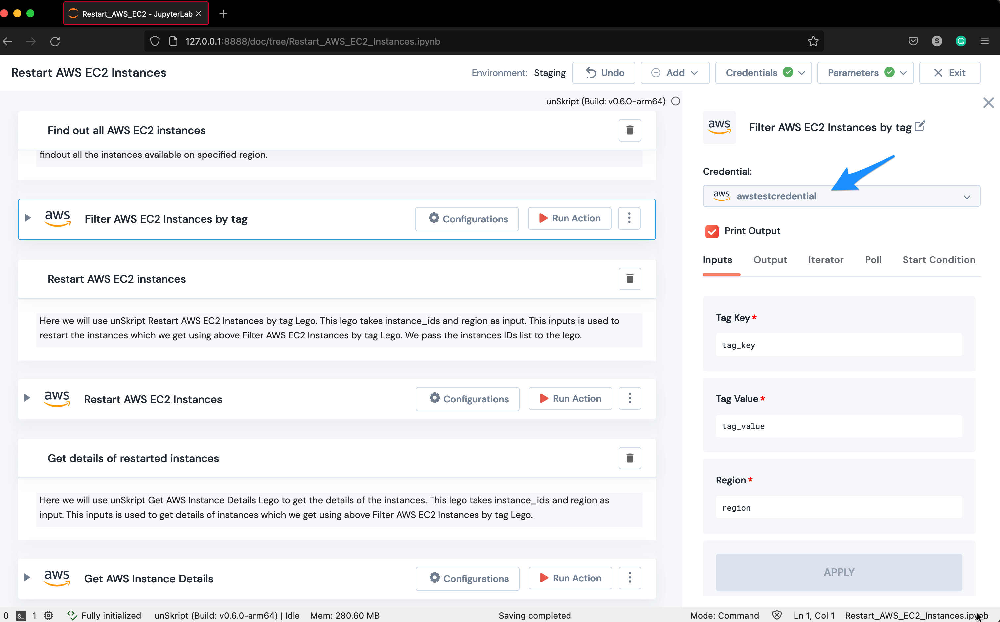
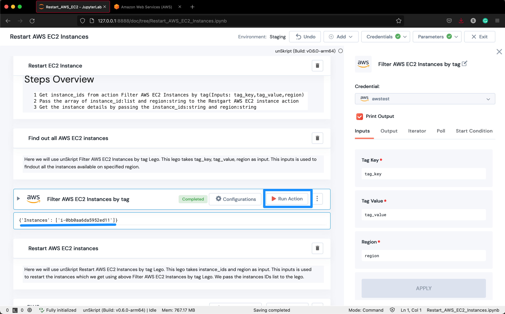

# Getting Started

As for the sample runbooks, you get the workflow already set up with all required actions pre-added. All you need to do is just Click and Play!

### **Launch unSkript Jupyter Notebooks**

While the docker is running in the background, you can choose a sample from an array of our open source xRunBooks as given below-

#### **AWS**

* [Restart AWS EC2 Instances](http://127.0.0.1:8888/lab/tree/Restart\_AWS\_EC2\_Instances.ipynb)
* [Configure URL to a Cloudwatch alarm](http://127.0.0.1:8888/lab/tree/Configure-url-endpoint-on-a-cloudwatch-alarm.ipynb)
* [EC2 Disk Cleanup](http://127.0.0.1:8888/lab/tree/ec2-disk-cleanup.ipynb)
* [Get AWS unhealthy ELB instances](http://127.0.0.1:8888/lab/tree/get-aws-elb-unhealthy-instances.ipynb)
* [Detect ECS failed deployment](http://127.0.0.1:8888/lab/tree/Detect-ECS-failed-deployment.ipynb)
* [Resize EBS volume](http://127.0.0.1:8888/lab/tree/resize-ebs-volume.ipynb)
* [Resize AWS instances given tag](http://127.0.0.1:8888/lab/tree/restart-aws-instance-given-tag.ipynb)
* [Restart unhealthy services target group](http://127.0.0.1:8888/lab/tree/restart-unhealthy-services-target-group.ipynb)

#### **MongoDB**

* [MongoDB server connectivity/ Kill long-running queries](http://127.0.0.1:8888/lab/tree/MongoDB\_Server\_Connectivity.ipynb)

#### **Kubernetes**

* [K8s Pod stuck in CrashLoopBack state](http://127.0.0.1:8888/lab/tree/K8S\_Pod\_Stuck\_In\_CrashLoopBack\_State.ipynb)
* [K8s Pod stuck in ImagePullBackOff state](http://127.0.0.1:8888/lab/tree/K8S\_Pod\_Stuck\_In\_ImagePullBackOff\_State.ipynb)
* [K8s Pod stuck in Terminating state](http://127.0.0.1:8888/lab/tree/K8S\_Pod\_Stuck\_In\_Terminating\_State.ipynb)
* [Get Kubernetes system config map](http://127.0.0.1:8888/lab/tree/get-kube-system-config-map.ipynb)
* [Get candidate nodes from a given configuration](http://127.0.0.1:8888/lab/tree/k8s-get-candidate-nodes-given-config.ipynb)
* [Resize Kubernetes PVC](http://127.0.0.1:8888/lab/tree/resize-pvc.ipynb)

#### **PostgreSQL**

* [Display long-running queries](http://127.0.0.1:8888/lab/tree/Display-postgresql-long-running.ipynb)

#### **Jenkins**

* [Fetch Jenkins build logs](http://127.0.0.1:8888/lab/tree/fetch-jenkins-build-logs.ipynb)

The links given above will redirect you to the chosen sample Jupyter Notebook. For this tutorial, we will use the [Restart AWS EC2 Instances](http://127.0.0.1:8888/lab/tree/Restart\_AWS\_EC2\_Instances.ipynb) xRunbook.

After opening the link you will see-

<figure><figcaption>
Starting page of the notebook
</figcaption></figure>


In general, the URL will look like this - <mark style="color:orange;background-color:yellow;">`http://127.0.0.1:8888/doc/tree/`</mark>_<mark style="color:orange;background-color:yellow;">`<Sample_Notebook_Name>`</mark>_<mark style="color:orange;background-color:yellow;">`.ipynb`</mark>

Port used - As specified in the docker image, port <mark style="color:orange;background-color:yellow;">`8888`</mark>will be occupied.


As shown in the picture above, there is a **Jupyter Notebook** (.ipynb file) which contains a runbook to Restart an EC2 Instance.

### How to add Credentials?

Next, you have to add the credentials to execute this runbook. unSkript supports many connectors using which you can create your connection to the resource.

Some of the connectors supported by unSkript are MySQL, Snowflake, MongoDB, Graphana, Datadog, JIRA, GitHub, AWS, GCP, Kubernetes, SSH, REST APIs, Slack, Airflow, and many more.

For this example, we need to create a connection to AWS. To do so, click on the <mark style="color:orange;background-color:yellow;">`Credentials`</mark> button and then click on <mark style="color:orange;background-color:yellow;">`Add Credential`</mark>-

<figure><figcaption>
Add Credentials button
</figcaption></figure>

Click on the resource's tile for which you want to create the credential-

<figure><figcaption>
Choose a resource
</figcaption></figure>

Let's create a credential for **AWS** for now, but you can select from any one of the available options and add details as requested for that resource-

<figure><figcaption>
Add the details for the credential
</figcaption></figure>

### How to add Parameters?

You can give parameters to your runbook which may be required to execute a particular action.

In our example, there are three mandatory parameters - region, tag\_key, and tag\_value. (tag\_key is the Key that maps to the EC2 instance’s key and tag\_value corresponds to its Value)

Navigate to the <mark style="color:orange;background-color:yellow;">`Parameters`</mark>button on the top right corner of the page and click on Edit Value-

<figure><figcaption>
Edit parameter values
</figcaption></figure>

Fill in the required details for the connection as shown in the dialog box and click on save-

<figure><figcaption>
Save parameter values
</figcaption></figure>


This should turn <mark style="color:orange;background-color:yellow;">`Parameters⚠️`</mark> button to <mark style="color:orange;background-color:yellow;">`Parameters✅`</mark>


### How to configure an Action?

Configuring an action to perform a required task can be done by clicking on the <mark style="color:orange;background-color:yellow;">`Configurations`</mark> button.

In our example, navigate to the second action i.e. Filter AWS EC2 Instances by tag-

<figure><figcaption>
Click on Configurations to show the configurations section
</figcaption></figure>

Select the credentials in the configurations section-

<figure><figcaption>
The newly created credentials can be selected from the drop down
</figcaption></figure>

You can also configure the following items in the configurations section-

* Inputs- Each task has inputs based on the action being used. These inputs need to be populated using parameters. The inputs are pre-configured for you in the notebook. All you have to do is give values to these inputs by clicking on the parameters button as explained in the previous section.
* Output - In order to capture the output of the task in a variable, use the Output configuration. The string used in this dialogue is the name of the variable that will contain the output of this task. You can use this variable as an input in any subsequent Task.
* Iterator - Iterator is a list of input parameters that can be configured to set a loop on the input schema field (Loop Parameter). More than one item can be specified in the list for the iteration.
* Poll - Polls can be used to wait for the function to return a specified expected condition. It takes in the output type, value, interval, and timeout values.
* Start Condition - A python condition can be given as a start condition to run the task.

Some of these items are pre-configured in the sample notebooks. You can always customize them as per your wish.

To know more about these configuration items you can check out this section -


[action-configuration](../../guides/actions/action-configuration/)


### How to execute an Action?

You need to click on the <mark style="color:orange;background-color:yellow;">`Run Action`</mark>button to execute the action-

<figure><figcaption>
Run action for a lego
</figcaption></figure>

You can similarly configure all other actions in the notebook and execute them one by one.

In the next section, you will see how to create custom actions and notes, and get an overview of the platform.
