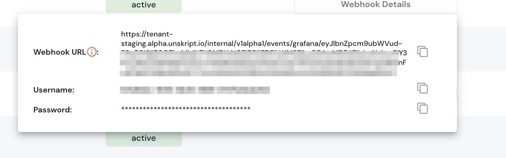

# Create an Alarm Webhook

unSkript currently supports webhooks for Grafana and AWS (Cloudwatch). The process for creating a webhook is the same.

1. In your unSkript dashboard, go to the proxies tab.  Choose the environment you wish to connect to and then find the Grafana or AWS connection that you wish add the Webhook to:
2. If there is no webhook created, there will be a "Generate" button in the webhook column.  If you have already created a webhook, the button will say "webhook details".

<figure><figcaption>
Connections in a proxy
</figcaption></figure>

3. Click Generate to create the webhook:

<figure><figcaption></figcaption></figure>

Use these credentials to set up the alarming connection.

