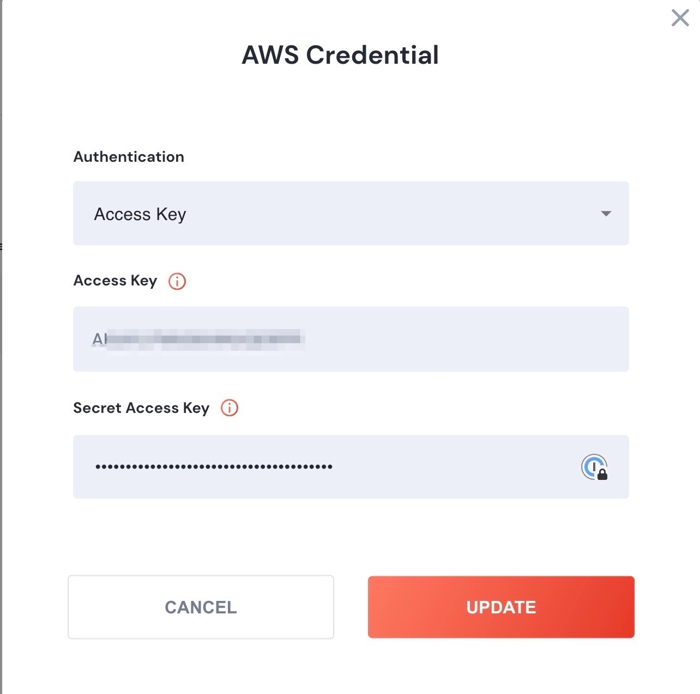

# Create a Credential

Any Action that connects to an external service will require a Credential.  To learn how to create a credential to a specific provider, check the section on [Connectors](../../connnecting/connectors/).  Each Connector service has instructions on how to add a Credential.

### &#x20;Example: Creating a Credential for AWS:



1. Under Proxies/Environments, click **Create Credential** (Or you can add a new credential when editing an Action in an xRunBook).
2. Choose AWS as your credential.
3. Name your credential (and add an optional [serviceID](create-a-credential.md#serviceid))

<figure><figcaption>
Step 1 of adding a Credential
</figcaption></figure>

4\.  After Clicking next, ypu'll be prompted to add your authorization credentials.  In the case of AWS, it is a key and secret:

<figure><figcaption>
Adding your Key and Secret
</figcaption></figure>

Now your Credential will be saved. It'll be ready for use in a few seconds.

## ServiceID

When adding a Credential, a serviceID can be added. ServiceID is a variable abstraction of the Credential. &#x20;

When a xRunBook is run in multiple [environments](../../connnecting/proxies/connect-your-environment/), different credentials might be used (for example - the AWS connection in dev might be different than the one used in production). &#x20;

To use a serviceID:

1. For your credentials - give them a serviceID (that is the same across all environments).  For example: AWS\_ServiceID.
2. Open your xRunbook, and for each Action, change the credential Slider to ServiceID, and choose the serviceId.
3. Now, when you run the RunBook, you'll be prompted to choose an environment, and unSkript will use the credentials (via the serviceId) for that environment.
